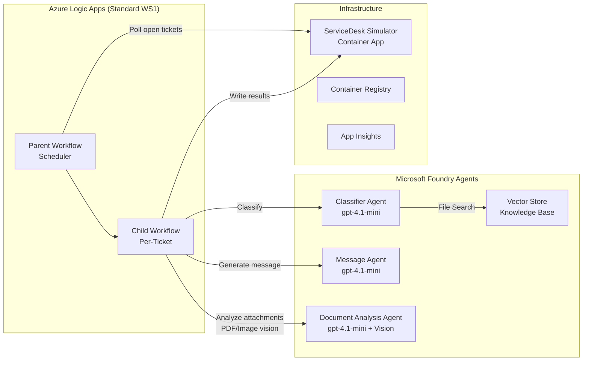

# AI Ticket Automation

**Logic Apps (Parent–Child) + Microsoft Foundry Agents** — Automated HR ticket classification, document analysis, and response generation with vision-based attachment parsing.

## Architecture



## Components

| Component | Service | Purpose |
|-----------|---------|---------|
| Orchestrator | Logic Apps Standard (WS1) | Parent-child workflow; polls, classifies, analyzes, responds |
| Classifier Agent | Foundry Agent (gpt-4.1-mini) | Category, subcategory, operator group, language, confidence |
| Message Agent | Foundry Agent (gpt-4.1-mini) | HR summary + employee message generation |
| Document Analysis Agent | Foundry Agent (gpt-4.1-mini + Vision) | Visual parsing of PDF/image attachments (invoices, certificates) |
| Knowledge Base | Foundry Vector Store | Taxonomy, sample incidents, operator groups |
| Ticket System | Container App (Python/FastAPI) | ServiceDesk simulator with real PDF/image attachments |
| Monitoring | Application Insights | Telemetry, traces, continuous evaluation |
| Registry | Azure Container Registry | Container image storage |
| Identity | User-Assigned Managed Identity | Logic App → Foundry authentication |

## Project Structure

```
├── agents/
│   ├── prompts/                    # Agent system prompts (version controlled)
│   │   ├── classifier-agent.md
│   │   ├── message-agent.md
│   │   └── document-analysis-agent.md
│   ├── data/                       # Vector store documents
│   │   ├── category-taxonomy.md
│   │   ├── sample-incidents.md
│   │   └── operator-groups.md
│   ├── evals/                      # Evaluation datasets & configs
│   │   ├── classifier-golden-dataset.jsonl
│   │   ├── document-analysis-golden-dataset.jsonl
│   │   └── message-golden-dataset.jsonl
│   ├── classifier-agent.json       # Agent definition snapshots
│   ├── message-agent.json
│   └── document-analysis-agent.json
├── infra/                          # Bicep IaC (azd compatible)
│   ├── main.bicep
│   ├── main.parameters.bicepparam
│   └── modules/
│       ├── ai-foundry.bicep
│       ├── app-insights.bicep
│       ├── container-app.bicep
│       ├── container-registry.bicep
│       ├── identity.bicep
│       ├── keyvault.bicep
│       └── logic-app.bicep
├── scripts/                        # Automation scripts
│   ├── bootstrap.ps1               # One-shot setup (az login → azd up)
│   ├── deploy-agents.py            # Agent + vector store provisioning
│   ├── create_agents.py            # Agent creation logic
│   ├── upload_knowledge.py         # Vector store document upload
│   ├── generate_attachments.py     # Generate real PDF/image files
│   ├── run_evaluation.py           # Continuous evaluation setup
│   ├── post-provision.ps1          # azd post-deploy hook
│   └── requirements.txt            # Script dependencies
├── src/
│   ├── logic-app/                  # Logic Apps workflow definitions
│   │   ├── parent-scheduler/       # Polls open tickets on schedule
│   │   ├── child-process-ticket/   # Per-ticket: classify → analyze → respond
│   │   └── host.json
│   └── servicedesk-simulator/      # Python FastAPI mock ServiceDesk
│       ├── app.py                  # FastAPI entry point
│       ├── models.py               # Pydantic models (Ticket, Attachment)
│       ├── database.py             # In-memory store with seed data
│       ├── seed_data.py            # Predefined test tickets
│       ├── attachment_data.py      # Simulated attachment content
│       ├── attachments/            # Generated PDF/image files (base64 at runtime)
│       ├── routes_api.py           # REST API endpoints
│       ├── routes_ui.py            # Dashboard UI routes
│       ├── templates/              # Jinja2 HTML templates
│       └── Dockerfile
└── azure.yaml                      # azd project definition
```

## Quick Start

### Prerequisites

- [Azure Developer CLI (azd)](https://learn.microsoft.com/azure/developer/azure-developer-cli/install-azd)
- [Azure CLI](https://learn.microsoft.com/cli/azure/install-azure-cli)
- Python 3.11+
- Docker
- An Azure subscription with access to Azure AI Services

### Deploy (One-Shot Bootstrap)

```powershell
# Clone and bootstrap everything
git clone https://github.com/san360/ai-ticket-automation.git
cd ai-ticket-automation

az login
./scripts/bootstrap.ps1
```

The bootstrap script:
1. Checks prerequisites (az, azd, python, docker, git)
2. Detects your Azure subscription
3. Configures the azd environment
4. Runs `azd up` (provisions infrastructure + deploys app)
5. Post-deploy hook creates agents, uploads knowledge base, deploys Logic App

### Manual Deploy

```bash
azd auth login
azd up
```

### Local Development

```bash
# Run ServiceDesk Simulator locally
cd src/servicedesk-simulator
pip install -r requirements.txt
uvicorn app:app --reload --port 8000
```

Open http://localhost:8000 for the ticket dashboard UI.

### Generate Attachment Files

```bash
# Regenerate PDF/image files from attachment text data
pip install fpdf2 Pillow
python scripts/generate_attachments.py
```

## Ticket Processing Flow

```
1. Parent scheduler polls /api/incidents?status=open
2. For each open ticket → invoke child workflow:
   a. Classify ticket (Classifier Agent + Vector Store)
   b. Check for attachments:
      - Has file_data (base64)? → Vision parse (PDF via input_file, images via input_image)
      - No file_data? → Text-only analysis from extracted_text
   c. Generate response message (Message Agent)
   d. Write classification + analysis + message back to ticket
3. Ticket status → processed_by_ai
```

## Agents

### Classifier Agent
- **Model**: gpt-4.1-mini
- **Tools**: File Search (vector store with taxonomy + sample incidents)
- **Output**: Structured JSON — category, subcategory, operator group, language, confidence (0.0–1.0), missing info

### Message Agent
- **Model**: gpt-4.1-mini
- **Tools**: None (instructions-only)
- **Output**: HR summary (English) + employee message (ticket language + English)
- **Scenarios**: A (confirmation) or B (request missing info)

### Document Analysis Agent
- **Model**: gpt-4.1-mini (vision-enabled)
- **Tools**: Web Search (doctor/vendor verification)
- **Input**: Base64-encoded PDF (`input_file`) or image (`input_image`)
- **Output**: Structured JSON — document validity, extracted info (amounts, currencies, dates), verification status, recommendation

**Supported document types:**
| Type | Examples | Key Extractions |
|------|----------|-----------------|
| Medical certificates | Doctor's notes, Arztzeugnisse | Patient, doctor, dates, incapacity %, GLN verification |
| Expense invoices | Hotel, transport, meals | Amount + currency (EUR/CHF), vendor, line items |
| Receipts | Taxi, restaurant | Total, date, payment method |

## Attachments & Vision Parsing

The simulator provides **real rendered documents** (not just text):
- PDFs generated from invoice/certificate content using `fpdf2`
- JPEG/PNG receipt images rendered with `Pillow`
- Base64-encoded at runtime and passed to the agent via multimodal input
- Agent uses GPT-4.1-mini vision to parse documents directly — extracting amounts, currencies, names, and dates from the visual content

This ensures reliable extraction of financial details (e.g., EUR/CHF amounts) that text-only approaches sometimes miss.

## Evaluation

### Continuous Evaluation (Foundry)

Configured via `scripts/run_evaluation.py` — monitors agent quality on every response:
- Quality evaluators: Relevance, Coherence, Fluency
- Event trigger: `RESPONSE_COMPLETED` per agent
- Max 100 runs/hour per agent

### Golden Datasets

Located in `agents/evals/`:
- `classifier-golden-dataset.jsonl` — Classification accuracy test cases
- `document-analysis-golden-dataset.jsonl` — Document parsing test cases
- `message-golden-dataset.jsonl` — Response generation test cases

## Security

- Logic App authenticates to Foundry via **User-Assigned Managed Identity**
- Managed Identity has: Cognitive Services OpenAI User + Contributor roles
- Project MI has: Foundry User/Owner + Log Analytics Reader (for continuous eval)
- No API keys in application settings — all token-based auth
- Container App uses ACR managed identity pull

## Cost Estimate

| Resource | SKU | Estimated Monthly Cost |
|----------|-----|----------------------|
| Logic Apps Standard | WS1 | ~CHF 150 |
| AI Services (gpt-4.1-mini) | GlobalStandard | ~CHF 20–50 (usage-based) |
| Container App | Consumption | ~CHF 5 |
| Container Registry | Basic | ~CHF 5 |
| Application Insights | Pay-as-you-go | ~CHF 5 |
| Key Vault | Standard | ~CHF 1 |
| **Total** | | **~CHF 186–216** |

## Useful Commands

```bash
azd env get-values        # View all deployment outputs
azd monitor               # Open Application Insights
azd down                  # Tear down all resources

# Redeploy agents only
cd scripts
python deploy-agents.py

# Reset simulator data
curl -X POST https://<container-app-url>/api/reset
```

## License

MIT
