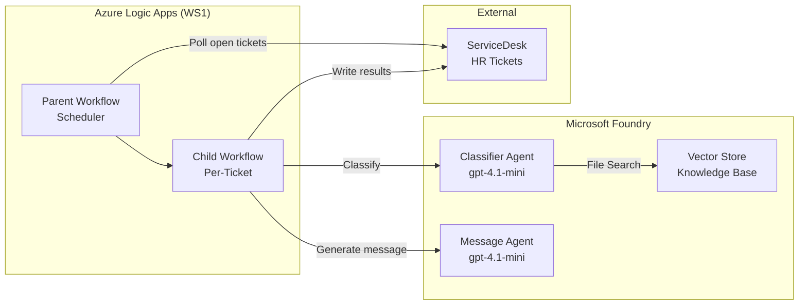

# AI Ticket Automation

**Logic Apps (Parent–Child) + Microsoft Foundry Agents** — Automated HR ticket classification and response generation.

## Architecture



## Components

| Component | Service | Purpose |
|-----------|---------|---------|
| Orchestrator | Logic Apps Standard (WS1) | Parent-child workflow pattern |
| Classifier Agent | Foundry Agent (gpt-4.1-mini) | Category, subcategory, operator group, confidence |
| Message Agent | Foundry Agent (gpt-4.1-mini) | HR summary + employee message generation |
| Knowledge Base | Foundry Vector Store | Taxonomy, sample incidents, operator groups |
| Ticket System | ServiceDesk Simulator (Python/FastAPI) | Mock incident API with rich UI |
| Secrets | Azure Key Vault | API credentials management |
| Identity | User-Assigned Managed Identity | Logic App → Foundry authentication |

## Project Structure

```
├── .github/workflows/       # CI/CD pipelines
│   ├── ai-evaluation.yml    # PR evaluation pipeline
│   └── deploy.yml           # Infrastructure & agent deployment
├── agents/
│   ├── prompts/             # Agent system prompts (version controlled)
│   │   ├── classifier-agent.md
│   │   └── message-agent.md
│   └── data/                # Vector store documents (synthetic)
│       ├── category-taxonomy.md
│       ├── sample-incidents.md
│       └── operator-groups.md
├── evaluation/              # Agent evaluation framework
│   ├── generate_dataset.py  # Synthetic eval dataset generator
│   ├── run_eval.py          # Evaluation runner with quality gates
│   └── requirements.txt
├── infra/                   # Bicep IaC (azd compatible)
│   ├── main.bicep
│   ├── main.parameters.bicepparam
│   └── modules/
├── scripts/                 # Deployment automation
│   ├── deploy-agents.py     # Agent + vector store provisioning
│   └── post-provision.ps1   # azd post-provision hook
├── src/
│   ├── logic-app/           # Logic Apps workflow definitions
│   │   ├── parent-scheduler/
│   │   └── child-process-ticket/
│   └── servicedesk-simulator/   # Python FastAPI mock ServiceDesk
│       ├── main.py
│       ├── templates/
│       └── Dockerfile
└── azure.yaml               # azd project definition
```

## Quick Start

### Prerequisites

- [Azure Developer CLI (azd)](https://learn.microsoft.com/azure/developer/azure-developer-cli/install-azd)
- [Azure CLI](https://learn.microsoft.com/cli/azure/install-azure-cli)
- Python 3.11+
- An Azure subscription with access to Azure AI Services

### Deploy

```bash
# Clone the repo
git clone https://github.com/san360/ai-ticket-automation.git
cd ai-ticket-automation

# Login and provision everything
azd auth login
azd up
```

This will:
1. Deploy all Azure infrastructure (Foundry, Logic Apps, Key Vault, Container App)
2. Deploy the ServiceDesk Simulator container
3. Create Foundry agents and upload vector store data
4. Configure Logic App with agent endpoints

### Local Development

```bash
# Run ServiceDesk Simulator locally
cd src/servicedesk-simulator
pip install -r requirements.txt
uvicorn main:app --reload --port 8000
```

Open http://localhost:8000 for the ticket dashboard UI.

## Evaluation

The project includes a comprehensive evaluation framework for the classification agent:

### Metrics

| Metric | Type | Threshold | Description |
|--------|------|-----------|-------------|
| Classification Accuracy | Custom | ≥ 0.80 | Weighted score across all classification fields |
| Category Match | Custom | ≥ 0.85 | Exact match on primary category |
| Language Detection | Custom | ≥ 0.95 | Correct language identification |
| Missing Info Recall | Custom | — | Detection of required missing information |
| Confidence Calibration | Custom | — | Confidence score vs. actual accuracy |
| Relevance | AI-assisted | ≥ 3.0 | Response relevance to the query |
| Coherence | AI-assisted | ≥ 3.0 | Logical consistency of output |
| Groundedness | AI-assisted | — | Grounded in provided context |
| F1 Score | NLP | — | Token-overlap with ground truth |

### Run Evaluation Locally

```bash
cd evaluation
pip install -r requirements.txt
python generate_dataset.py
python run_eval.py
```

### CI Integration

Evaluation runs automatically on PRs that modify agent prompts or data. Quality gates block merges if thresholds are not met.

## Agent Design

### Classifier Agent

- **Model**: gpt-4.1-mini
- **Tool**: File Search (vector store with taxonomy + sample incidents)
- **Output**: Structured JSON with category, confidence score, and missing info detection
- **Confidence scoring**: 0.0–1.0 scale with reasoning

### Message Agent

- **Model**: gpt-4.1-mini
- **Tools**: None (instructions-only)
- **Output**: HR summary (English) + employee message (ticket language + English)
- **Scenarios**: A (confirmation) or B (request missing info)

## Security

- Logic App authenticates to Foundry via **User-Assigned Managed Identity**
- API credentials stored in **Azure Key Vault**
- RBAC: Cognitive Services OpenAI User + Contributor on Foundry resource
- No local auth keys in application settings

## Cost Estimate

| Resource | SKU | Estimated Monthly Cost |
|----------|-----|----------------------|
| Logic Apps Standard | WS1 | ~CHF 150 |
| AI Services (gpt-4.1-mini) | GlobalStandard | ~CHF 20–50 (usage-based) |
| Container App | Consumption | ~CHF 5 |
| Key Vault | Standard | ~CHF 1 |
| **Total** | | **~CHF 176–206** |

## License

MIT
